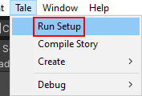
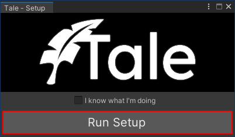
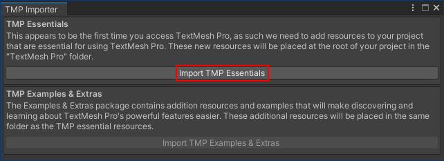

<p align="center">
  
</p>

# About <a href="https://unity.com"></a>

**Tale** is a powerful prop manipulation utility designed for storytelling. You can use it in your games to show dialog, play sounds and videos, manipulate the camera, create transitions, and much more.
Everything is very customizable; you give Tale a bunch of objects and animations, and it does the heavy lifting.

Here's what Tale currently provides:

- **Scene Manipulation**
- **Dialog**, with support for:
  - rich text
  - avatars
  - additive mode (continue the previous reply)
  - animations like click-to-continue
  - voices:
    - normal and also looping (for Undertale-like voices)
    - reverb effect (for monologue or "inner" voices)
- **Cinematics**, with support for:
  - Videos
  - Subtitles
  - Images, with multiple animations like crossfade
- **Audio**, with support for:
  - Multi-Channel sound
  - Music, with loop/shuffle support
- **Transitions**, based on custom animations
- **Camera Manipulation**, with support for:
  - Post-Processing
  - zoom, position and rotation
- **Transform Manipulation**, with support for:
  - position and rotation
- **Other Actions**, such as:
  - Exec, for custom code that runs on the Tale queue
  - Repeat and Delay, for managing other actions
  - Multiplex and Parallel, for orchestrating many actions at the same time
- **Editor Macros**, for setting up Tale and adding new props as easily as possible
- **Script Compiler**, for easily generating Tale code from story scripts

You can easily extend Tale by creating your own actions.

> Check out `Assets/Scripts/Tale/Action/WaitAction.cs` to see how to implement a simple action.

# Getting started

1. **Copy** the files from this **repo's** `Assets` folder into your **project's** `Assets` folder
2. In the **toolbar**, click `Tale -> Setup -> Run Setup`. If you don't see this, reload via `CTRL + R`
3. **Click** `Run Setup`
4. **Click** `Import TMP Essentials` **if** a window pops up (Tale needs the TextMeshPro Essentials package)
5. All done. Tale is now fully operational.

<p align="center">
  
</p>

<p align="center">
  
</p>

<p align="center">
  
</p>

## Extra (not required)

The Tale source code is located in `Assets/Scripts/Tale`. The `Assets/Resources` dir contains additional resources, such as the Tale logo (which is used in the splash scene).

There is currently no documentation; there will be one someday.

Here's the old setup in case you want to manually set up Tale, or want to see how it works: [old setup guide](https://github.com/deprimus/Tale/blob/master/SETUP.md).

Tale has support for the old Post Processing V2 stack for effects like Bloom.

If you want those:

1. In your project, open `Window -> Package Manager`
2. Choose `Packages: In Unity Registry`
3. Search `Post Processing` and install it

You will have to *manually* set up post processing. For this, check out the post processing section in the [old setup guide](https://github.com/deprimus/Tale/blob/master/SETUP.md#post-processing).

# Story scripts

## Compiling
If you have a story script, you can compile it to Tale code. Simply open the menu `Tale -> Compile Story` and select the file.

The Tale scripts will be generated under `Assets/Scripts/Scenes`, and you will also see `Dialog.cs` and `Transition.cs` which contain helper methods.

## What are they?
Story scripts are basically markdown files in a specific format. When you develop a game, you usually write a script for the game story.

The script describes the scenes and dialog. If you write this script in the format shown below, Tale will be able to compile it to C# code
which is compatible with Tale.

```md
...

# Script

## Scene 1

This is a description. It will be inserted as a C# comment.

Character1: This is dialog. It will be compiled to Tale.Dialog()
Character2: Yes.

There is also support for reverb.

Character1: (This dialog will be compiled with reverb: true).

---

Pauses like the one above will compile to Tale.Wait().

## Scene 2

Scenes don't have to be named 'Scene'. If the are, they will be renamed to 'Story', as
to not confuse story scenes with the game scenes.

This scene will be compiled to 'Story_2.cs'.

## End - The last encounter

Any spaces or special characters in the name will be removed or replaced with an underscore.

This scene will be renamed and compiled into 'End_The_last_encounter.cs'
```

The compiler will simply ignore what isn't under `# Script`, so you don't have to cut your original script to make it compile.

# Design

At its core, Tale is a modular framework that can run various actions (either sequentially or in parallel).
These actions manipulate objects and components in an useful way. For example, the dialog action uses a canvas, some animators and some text components
to provide a very customizable dialog system. All you have to do is to create these objects and to give them to Tale.

The framework provides a queue-driven action system, support for parallel actions, and multiple built-in actions.                                                                                 

Tale also includes a Trigger system which allows scripts to send events to each other. This is mostly used by actions, but works perfectly fine for other use cases.

# Implementation

Tale was designed for Unity 2020. The Post-Processing actions are not guaranteed to work with newer versions because they rely on the old Post Processing Stack v2.

We haven't encountered any problems for Unity 2020. If you find one, open an issue. We haven't tested newer versions yet; when we eventually do it, you'll see a compatibility matrix here.


# Releases

None.

# License <a href="https://github.com/deprimus/Tale/blob/master/LICENSE"></a>

**Tale** was developed by the [Deprimus](https://wiki.deprimus.men) members. It is licensed under the [MIT license](https://github.com/deprimus/Tale/blob/master/LICENSE).

Everything present in the [resources](https://github.com/deprimus/Tale/tree/master/resources) directory is UNLICENSED. The Tale developers do not own any files in that directory (except for the README). They are included
for convenience.

The Tale logo in the `Assets/Resources` directory is licensed under MIT.

The Tale splash sound in the `Assets/Resources` directory is part of a song named Return to Darkness by [YouFulca](https://youfulca.com/). The terms of use from [here](https://youfulca.com/en/kiyaku_jp/) apply to this asset.