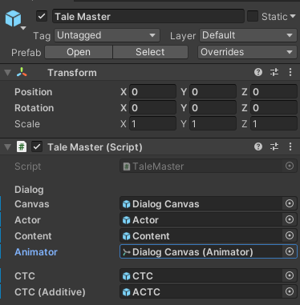
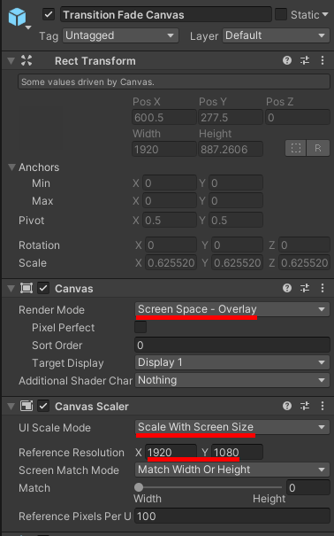
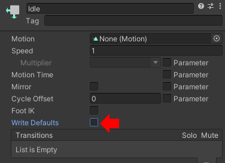

<p align="center">
  
</p>

# Setup

This document describes the setup process for [Tale](https://github.com/deprimus/Tale), a storytelling and prop manipulation utility for Unity.

After following the setup process, you may start using Tale. Reading the [documentation]() is highly recommended for beginner users.

This setup assumes you have at least minimal knowledge about Unity, the entity component system (ECS), and the C# programming language.
You need to know what components are and how to add them to objects. The optional setup may require additional knowledge.

The setup is split into 2 parts: required and optional. The former describes how to set up the Tale core, while the latter describes
how to set up optional modules.

## Glossary

Here are a collection of words that you will encounter in the context of Tale.

- Prop: an object or component which can be manipulated by Tale. Usually refers to a GameObject, an Animator, an AudioSource, etc
- Master: the Tale Master object which has a `TaleMaster` component
- Queue: actions are placed on a queue. After the first action in the queue finishes, it is removed the next one starts. This goes on forever
- Parallel: some actions can be added to the the parallel list. All of the actions in the parallel list execute at the same time, and also
don't interfere with the queue. Once an action is finished, it is removed from the list
- Parallel Pointer: points to one or more actions that are in the parallel list, usually used to manually remove actions
- Multiplex: a multiplex action. Executes multiple actions at a time until they all finish. After that, the multiplex action is marked as finished
- Group: a GameObject which has the purpose of grouping props of a certain category (dialog, audio, etc)
- Actor: the person who speaks in a dialog
- Override Dialog: normal dialog. When an actor speaks, the dialog text will be erased and replaced by the new reply
- Additive Dialog: when an actor speaks using additive mode, the next reply will be added to the current dialog text
- CTC: click-to-continue, in the context of dialog. This refers to the object that appears when the user is prompted to click or press a button in order to advance
- ACTC: additive CTC, which appears when there is additive dialog
- Cinematic: the cinematic canvas, which can contain an image, a video, or subtitles. Usually used to show cutscenes or introduction text
- Subtitles: text on the cinematic canvas, usually used as a way of storytelling or as actual subtitles for a video

## Prerequisites

You will need a new/existing Unity 2D project. For the purpose of this guide, a new project will be used.

Please note that Tale was developed for Unity 2020.3.2f1. It is not guaranteed to work with any other versions.

You will also need the Tale source code.

### Downloading Tale

If you want to use a Tale release, download the release archive (none as of now).

If you want to use the latest Tale version, clone the repository (or download as zip).

## Required Setup

This section contains all necessary steps required to get Tale up and running. This section is mandatory and cannot be skipped.

Open your Unity project and make sure you have the Tale source code handy. The setup steps are as follows:

### 1. Copy the Tale scripts

In your project, if the `Assets/Scripts` directory doesn't exist, create it. Inside it, create another directory named `Tale`.

Go to the Tale source code, navigate inside the `src` folder, and copy everything to the `Assets/Scripts/Tale` folder.
This path is not imposed, but recommended.

The `Tale` directory should look something like this:

<p align="center">
  
</p>

After copying the files, you no longer need to have the Tale source code handy.

At this point, you may see an error: `The type or namespace name 'PostProcessing' does not exist...`. It will disappear
once you follow the next step.

### 2. Install the required dependencies

Tale relies on TextMesh Pro and PostProcessing. The former is usually already installed by Unity, and is only required for other
optional modules. The latter has to be manually installed and is required in order for Tale to work.

Go to `Window -> Package Manager`. At the top-right of the package manager window, to the left of the `+` icon, click on the `Packages`
dropdown box and select `Unity Registry`.

Search for `Post Processing` at the top left of the window. Click on the package that appears (it should be named `Post Processing`),
then click on the `Install` button at the bottom left of the window.

<p align="center">
  
</p>

> Note: in the future, the PostProcessing package will only be required if camera effects are enabled. For now, you have to install it even if you don't
> intend to use such effects.

### 3. Create the Tale Master object

The master object is the heart of Tale, and is responsible for single-handedly orchestrating all of the actions. If this object is disabled,
Tale will cease to function.

In your default scene, create a new empty game object. Call it `Tale Master` and add the `TaleMaster.cs` script to it. Make sure the object
is at the top of the hierarchy.

<p align="center">
  
</p>

<p align="center">
  
</p>

The master object should look something like this:

<p align="center">
  
</p>

Everything listed there is used by the optional modules. Details about them can be found in the [optional setup]() section.

> Note: the Tale master object can only be instantiated once. If any other objects with the TaleMaster component appear in the future,
> they will be automatically deleted. If you delete the master object at runtime, you will not be able to instantiate a new one.
> This prevents duplicate masters from being active at the same time.

### 4. Create the master prefab

In order for Tale to work properly, the master object must be present in every scene. Duplicate master objects will be automatically
deleted at runtime. This way, Tale can function regardless of the scene from which you start the game.

You may skip this step if you wish to add optional modules. However, don't forget to come back here after you finish setting everything up.

In your project, navigate to the `Assets/Prefabs` directory (create it if needed). Drag the master object into the prefab folder.

It should look like this:

<p align="center">
  
</p>

After doing so, drag the prefab into any existing/future scenes, and make sure that the master object always sits at the top of the hierarchy.

If you want to modify the master object (e.g. to add optional modules), you should modify the prefab. This is the reason why it is recommended to
finish setting up Tale before creating the prefab.

### 5. Test

If you want to see if Tale works properly, create a game object and attach the following script to it:

```cs
using UnityEngine;

public class TaleTest : MonoBehaviour
{
    void Start()
    {
        Tale.Exec(() => Debug.Log("Tale works."));
    }
}
```

Make sure to name the script `TaleTest.cs`. Press `Play` and check if `Tale works.` is logged. If so, Tale was correctly set up. You may now add optional
modules by following the optional setup.

## Optional Setup

This section contains all necessary steps required to set up any optional modules. The modules can be set up in no particular order. However, for the sake
of this guide, the modules will be set up in the order that they appear in.

Optional modules may require extra objects (props). These should be children of the master object.

Some modules make use of the Tale config file, which is located in `Assets/Scripts/Tale` (the Tale source code). The file is named `Config.cs`, and allows
you to adjust various parameters. Each module will describe each parameter that it makes use of.

### Dialog

The dialog module can be used to show dialog on the screen. Animations can be added in order to gracefully transition to and from dialog. There are also
CTC (click-to-continue) objects, which are objects that appear on the screen to prompt the player to click or press a button in order to advance the dialog.

The dialog module uses the following props:

- a canvas
- an Animator component (can be attached to the canvas itself)
- two objects with TextMeshProUGUI components (one for the actor, one for the content)
- two objects, CTC and ACTC (both are optional)

Here is the general flow of a dialog action:

- the dialog action starts running
- if the dialog canvas is not activated, it is activated and the DialogIn animation will be played (if animations are present)
- the dialog actor will be set, and the content will be typed character-by-character (if the dialog is in additive mode, the content
will be added to the existing text. Otherwise, it will replace the existing text)
- after the content is fully typed, the CTC object will be activated and placed after the text (or ACTC if the dialog is in additive mode)
- after the user advances the dialog, the CTC object is deactivated and:
  - if the next action is a dialog action, the canvas is left active
  - otherwise, the DialogOut animation is played (if present) and the canvas is deactivated
- the dialog action ends

First, create the dialog canvas and name it `Dialog Canvas`. If an EventSystem object is created, make sure that it is also a child of the master object.

<p align="center">
  
</p>

Make sure to change the scale mode to `Scale With Screen Size`. You can customize the reference resolution and match mode. In this example, 1920x1080 will be used.
The canvas `Render Mode` should be set to `Screen Space - Overlay`.

<p align="center">
  
</p>

Next, create the actor and content objects (`UI`->`Text - TextMeshPro`). In this example, they will be placed inside a Panel (`UI`->`Panel`).
If the following window pops up, click on `Import TMP Essentials`.

<p align="center">
  
</p>

<p align="center">
  
</p>

You may place these objects anywhere on the canvas and customize them however you like (width, height, font, style, etc). In this example,
the actor and content objects will be placed at the bottom of the screen inside a panel like this:

<p align="center">
  
</p>

Both objects should have their alignments set to top-left. You may change this, however please note that you won't be able to make use of CTC objects because
the position can only be determined accurately with top-left alignment. Other alignments will make the CTC objects appear in unexpected places.

If you don't want to use CTC objects, you can change the alignment with no compromises.

<p align="center">
  
</p>

You may also want to customize the overflow. In this example, the actor object uses `Ellipsis` while the content object uses `Scroll Rect`.

<p align="center">
  
</p>

<p align="center">
  
</p>

#### Animations

Every time a dialog action starts or ends, an animation will played in order to make a transition between normal gameplay and dialog.
You may skip adding animations, as they are entirely optional (in which case the dialog canvas will be the activated and deactivated with no transition).

If you want to add animations, you will need an Animator component (it doesn't have to be attached to the dialog canvas; it can be attached to,
for example, the panel that holds the actor and content objects). The animations can behave in any way: they can change the canvas opacity,
they can just move an object (e.g. a panel), or they can do something entirely different.

There are only 2 constraints:
- the controller must have 2 animations: one for DialogIn and one for DialogOut
- the controller must have 3 states: one for DialogIn, one for DialogOut, and one for Idle (Entry and Any State do not count).
- the states need to be connected in a certain way (see below)

In this example, the canvas opacity will be animated. In order to do this, a Canvas Group component will be added to the canvas.

<p align="center">
  
</p>

Two animations will be added:

- DialogIn: changes the canvas opacity from 0 to 1 in 0.5s
- DialogOut: changes the canvas opacity from 1 to 0 in 0.5s

It is recommended to save the animations in `Assets/Animations/Tale`.

<p align="center">
  
</p>

Make sure the dialog canvas has an **active** `Animator` component and that the controller is set correctly.
Set the update mode to `Unscaled Time`.

<p align="center">
  
</p>

The animations must not have loop time. This is checked by default, so make sure to uncheck it.

<p align="center">
  
</p>

The animation controller now needs to be set up in the `Animator` window. The states may look like this:

<p align="center">
  
</p>

Create a new state called `Idle`, and set it as the layer default state.

<p align="center">
  
</p>

For all states (including `Idle`), make sure to uncheck `Write Defaults`. It may interfere with Tale if left checked.

<p align="center">
  
</p>

Make sure the states corresponding to the animations are named exactly `DialogIn` and `DialogOut`. This is needed because Tale makes use of those names.

If you don't like these names, you may change them in the config file. Simply navigate to `Assets/Scripts/Tale` (the Tale source code), and open the `Config.cs`
file. Next, change the following:

- DIALOG_CANVAS_ANIMATOR_STATE_IN: this is the name of the state corresponding to the DialogIn animation
- DIALOG_CANVAS_ANIMATOR_STATE_OUT: this is the name of the state corresponding to the DialogOut animation

The state names must match these values. In this guide, the default names will be used.

After you make the changes, you can use the names that you provided. It's important to not use the same name for both states, as this leads to undefined behavior.

Create 3 triggers: one named `TransitionIn`, one named `TransitionOut` and one named `Neutral`. Like the animation states, the triggers must have these exact names,
which can be changed from the config file:

- DIALOG_CANVAS_ANIMATOR_TRIGGER_IN: this is for the `Idle`->`DialogIn` transition
- DIALOG_CANVAS_ANIMATOR_TRIGGER_OUT: this is for the `Idle`->`DialogOut` transition
- DIALOG_CANVAS_ANIMATOR_TRIGGER_NEUTRAL: this is for the `DialogIn`->`Idle` and `DialogOut`->`Idle` transitions

<p align="center">
  
</p>

Create the `Idle`->`DialogIn` transition, uncheck `Has Exit Time` and set the condition to `TransitionIn` (the name of your `In` trigger).

<p align="center">
  
</p>

Create the `Idle`->`DialogOut` transition in the same way (uncheck `HasExitTime`, set the condition to `TransitionOut`).

<p align="center">
  
</p>

Next, create the `DialogIn`->`Idle` transition. Uncheck `Has Exit Time`, open the settings menu, set the transition duration
to 0 (because the transition should happen immediately after the animation finishes), and set the condition to `Neutral` (the neutral trigger).

<p align="center">
  
</p>

Create the `DialogOut`->`Idle` transition in the same way (no exit time, transition time set to 0, neutral trigger).

The final controller should look like this.

<p align="center">
  
</p>

#### CTC Objects

After the dialog content is written, the user has to click or press a button in order to advance the dialog. To indicate to the user to do so,
Tale can show an object on the screen at the end of the dialog content. This object is called CTC (click-to-continue) and can be anything
(e.g. an animated arrow).

There are 2 CTC objects: one for normal dialog and one for additive dialog (this object is also called ACTC, which stands for additive CTC).
Both objects are optional and are created in the same way.

To add support for CTC, simply create an object on the dialog canvas (e.g. an image). In this example, 2 objects were created:
one to serve as the CTC and the other to serve as the ACTC. The objects are placed inside a panel, along with the other dialog props.
Both objects are simple images, the CTC object having the color green.

<p align="center">
  
</p>

<p align="center">
  
</p>

The objects can be placed anywhere on the canvas, as they will be positioned by Tale.

In some cases, you may want to make sure that the CTC objects render in front of the text and other dialog canvas elements (e.g. panel).
You can use sorting layers for this.

You may also add animations to these objects (looping animations that go on forever). Tale will only reposition, hide, and show the objects as needed,
and will not tamper with anything else.

If the CTC position feels off, you can change the following options in the config file:

- DIALOG_CTC_OVERRIDE_OFFSET_X: the X offset for the normal dialog CTC object
- DIALOG_CTC_OVERRIDE_OFFSET_Y: the Y offset for the normal dialog CTC object
- DIALOG_CTC_ADDITIVE_OFFSET_X: the X offset for the additive dialog ACTC object
- DIALOG_CTC_ADDITIVE_OFFSET_Y: the Y offset for the additive dialog ACTC object
- DIALOG_CTC_OVERRIDE_ALIGNMENT: the origin from which to calculate the offsets. Can be either the middle or the baseline of the last text line
(the difference is that the baseline is lower)
- DIALOG_CTC_ADDITIVE_ALIGNMENT: same as above but for ACTC

#### Config

Other config options for the dialog module are:

- DIALOG_CPS: characters-per-second, how fast to type the dialog content
- DIALOG_KEY_NEXT: an array of keys which, when pressed, advance the dialog
- DIALOG_KEY_SKIP: the key which, when held down, instantly skips over the dialog
- DIALOG_ADDITIVE_SEPARATOR: when an additive dialog action is executed, this will be appended to the old content. If this is `" "`, writing `Test.` after `Hello.`
in additive mode will yield `Hello. Test.`.
- TRANSITION_SKIP_SPEED: how fast to play the animations when the user advances the dialog while the animations are still playing (bigger = faster)

#### Finishing up

After setting up the dialog module, make sure that:

- the dialog canvas is **not active**, and has its properties set to the same values as the starting values for the DialogIn animation (e.g. if your animation
changes the canvas opacity from 0 to 1, make sure the canvas opacity is 0; only do this if animations are present)
- The event system object is **active**
- the actor and content objects are **active** and have **no text**
- the CTC and ACTC are **not active** (if present)

Tale will automatically activate and deactivate the props when needed, and expects these initial values.

In order for Tale to make use of the dialog module props, you need to register these props in the Tale master object.
Simply click on the master object and drag the objects where they belong.

<p align="center">
  
</p>

#### Test

You can test the dialog module by creating a dialog action. In this example, the previously mentioned test script is used:

```cs
using UnityEngine;

public class TaleTest : MonoBehaviour
{
    void Start()
    {
        Tale.Exec(() => Debug.Log("Tale works."));
        Tale.Exec(() => Debug.Log("Testing Dialog..."));

        Tale.Dialog("Test Actor", "Test Content");
    }
}
```

> Note: When you click Play in the editor, the deltaTime may be unstable in the first few frames. Because of this, if you
> create a dialog action right at the start, the DialogIn animation may have most of its frames skipped, making it look like
> the animation doesn't play. In this example, it should work fine because there are two exec actions before the dialog action,
> so it takes multiple frames to reach the dialog action (at which point the deltaTime is not as unstable). This may only be an
> issue if you create a dialog action that executes immediately after the Play button is pressed. This issue should not appear
> in builds.
>
> A fix for this issue is to use Tale.Wait(0.001f) at the beginning.

### Audio

The audio module can be used to play sounds and music. It is also used for dialog voices (this will be added in the future).
Tale supports multi-channel sound. A channel is simply an AudioSource. The more channels you have, the more sounds you will
be able to play at the same time. You can control each channel individually.

This module uses the following props:

- an object with an AudioSource component for the music
- multiple objects with AudioSource components for sounds (one for each channel)
- an object with an AudioSource component for the voice

Create an empty object called `Audio`. Make sure it is a child of the master object.

<p align="center">
  
</p>

#### Music
To add music support, create an object called `Music` and add an AudioSource component to it.

<p align="center">
  
</p>

Next, make the following changes to the AudioSource:

1. uncheck `Play On Awake`
2. set the `Priority` to high (in this case, it corresponds to the value 0)
3. open the `3D Sound Settings` and set the `Doppler Level` to 0
4. set the `Volume Rolloff` to `Linear Rolloff`
5. set the `Max Distance` to a high number, like 10100
6. set the `Min Distance` to a value close to the max distance, like 10000

<p align="center">
  
</p>

#### Sound
To add sound support, create an empty object called `Sound`. This will group all sound channels.

<p align="center">
  
</p>

Next, add as many channels as you want. These are objects that have AudioSource components (like the music object).
Make sure they are children of the sound object. Name them `ChannelN` where N is `0`->`number of channels - 1`.
In this example, 4 channels are created.

<p align="center">
  
</p>

Each channel should have an AudioSource component. Make the same changes that were listed above in the `Music` section
(uncheck `Play On Awake` etc). Each channel should look exactly like the music object.

#### Voice
Follow the steps listed in the `Music` section, but name the object `Voice` instead.

<p align="center">
  
</p>

#### Config

The config options for the audio module are:

- ASSET_ROOT_AUDIO_SOUND: the resources root directory for all sounds. This will be prepended to all sound paths. Must end with `/`.
If this is `Audio/Sound/`, and a sound action is created with the path `test`, the `Assets/Resources/Audio/Sound/test` file will be loaded.
- ASSET_ROOT_AUDIO_MUSIC: same as above, but for music

#### Finishing up

After setting up the audio module, make sure that:

- the audio object is **not active**
- the music object is **not active**
- every channel object, as well as the sound object, are all **not active**
- the voice object is **not active**

Tale will automatically activate and deactivate the props when needed, and expects these initial values.

In order for Tale to make use of the audio module props, you need to register these props in the Tale master object.
Simply click on the master object and drag the objects where they belong.

<p align="center">
  
</p>

Remarks:
- the audio object goes to the `Group`
- the sound object goes to the `Sound Group`
- for every channel, add an element for `Audio Sound` (make sure that the channels are listed in order)

#### Test

You can test the audio module by creating sound and music actions. Make sure that you have test audio files prepared in the path
specified in the config (by default `Resources/Audio/Sound/` and `Resources/Audio/Music/`). Note that you don't need to specify the
file extension when creating an audio action. In this example, the previously mentioned test script is used:

```cs
using UnityEngine;

public class TaleTest : MonoBehaviour
{
    void Start()
    {
        Tale.Exec(() => Debug.Log("Tale works."));
        Tale.Exec(() => Debug.Log("Testing Audio..."));

        // Note that sound and music actions are blocking, meaning that they will play sequentially and not at the same time.
        // You can use Tale.Parallel to make full use of music and multiple sound channels,
        // but that is out of the scope of this guide.

        Tale.Sound.Play("test_sound");    // Plays on channel 0. You should test all of your channels.
        Tale.Sound.Play(1, "test_sound"); // Plays on channel 1
        Tale.Sound.Play(2, "test_sound"); // Plays on channel 2
        Tale.Sound.Play(3, "test_sound"); // Plays on channel 3

        Tale.Music.Play("test_music");
    }
}
```

### Transitions

Transitions can be used to gracefully change scenes or to transition between gameplay sections. Behind the scenes, Tale only
activates/deactivates the transition canvas and plays the animations of the transition, meaning that you can use transitions
for anything and not just for switching scenes.

You can add as many transitions as you want (within the limits of a standard list: `2 147 483 647`)

Each transition uses the following props:

- a canvas
- an Animator component (can be attached to the canvas itself)

Most of the times, the animator animates other objects for the transition, such as images. For example, a fade transition
will make use of a black image. Therefore, while Tale only uses the above 2 props, the transition canvas will usually include at least one other object.

In this example, only one transition will be added. You can add as many as you want in the same way.

Create a canvas for your transition. It is recommended to prefix the canvas names with `Transition`. In this example, the canvas
will be named `Transition Fade Canvas`, because a fade transition will be added. Make sure to change the scale mode to `Scale With Screen Size`.
You can customize the reference resolution and match mode. In this example, 1920x1080 will be used. The canvas `Render Mode` should be set to `Screen Space - Overlay`.

If an EventSystem object is added, make sure it is a child of the master object.

<p align="center">
  
</p>

<p align="center">
  
</p>

Next, add the transition elements. You can animate anything. In this example, the fade transition will simply make the screen black.
In order to do this, a black image will be added to the canvas (with the same width and height as the screen). The image will be named
`Fade Darkness`.

<p align="center">
  
</p>

<p align="center">
  
</p>

Finally, add the transition animations. In this example, the canvas will have an Animator and a CanvasGroup component, and
the animations will simply change the canvas opacity (which, along with the black image, will create a fade effect).

Two animations will be added:

- TransitionFadeIn: changes the canvas opacity from 1 to 0 in 1s
- TransitionFadeOut: changes the canvas opacity from 0 to 1 in 1s

It is recommended to save the animations in `Assets/Animations/Tale`. For the Animator component, set the update mode to `Unscaled Time`.

<p align="center">
  
</p>

> You may notice that the dialog animations are:
> - In - the dialog canvas is shown
> - Out - the dialog canvas is hidden
>
> ...while the transition animations are the opposite:
> - In - the transition canvas is hidden
> - Out - the transition canvas is shown
>
> While it makes sense to say "FadeIn - fades in the fade transition canvas", it's unnatural to say "fade in" when you want to
> fade out of the scene, and "fade out" when you want to fade into the scene. This is why transitions have the animation names reversed.

The animations must not have loop time. This is checked by default, so make sure to uncheck it.

<p align="center">
  
</p>

The animation controller now needs to be set up in the `Animator` window. The states may look like this:

<p align="center">
  
</p>

Create a new state called `Idle`, and set it as the layer default state.

<p align="center">
  
</p>

For all states (including `Idle`), make sure to uncheck `Write Defaults`. It may interfere with Tale if left checked.

<p align="center">
  
</p>

Make sure the states corresponding to the animations are named exactly `TransitionIn` and `TransitionOut`. This is needed because Tale makes use of those names.

If you don't like these names, you may change them in the config file. Simply navigate to `Assets/Scripts/Tale` (the Tale source code), and open the `Config.cs`
file. Next, change the following option:

- TRANSITION_ANIMATOR_STATE_FORMAT: this is the format of the names, where `{0}` is `In` for the In transition and `Out` is for the Out transition. If the format is
`Transition{0}`, you will need to name the states `TransitionIn` and `TransitionOut`

It's important to use `{0}` at least once in the format. Not doing so will lead to undefined behavior.

In this guide, the default format will be used.

Create 3 triggers: one named `TransitionIn`, one named `TransitionOut` and one named `Neutral`. Like the animation states, the triggers must have these exact names,
which can be changed from the config file:

- TRANSITION_ANIMATOR_TRIGGER_FORMAT: same as TRANSITION_ANIMATOR_STATE_FORMAT, but for triggers
- TRANSITION_ANIMATOR_TRIGGER_NEUTRAL: this is for the `TransitionIn`->`Idle` and `TransitionOut`->`Idle` transitions

<p align="center">
  
</p>

Create the `Idle`->`TransitionOut` transition, uncheck `Has Exit Time` and set the condition to `TransitionOut` (the name of your `Out` trigger).

<p align="center">
  
</p>

Create the `Idle`->`TransitionIn` transition in the same way (uncheck `HasExitTime`, set the condition to `TransitionIn`). You should end up with something like this:

<p align="center">
  
</p>

Next, create the `TransitionOut`->`Idle` transition. Uncheck `Has Exit Time`, open the settings menu, set the transition duration
to 0 (because the transition should happen immediately after the animation finishes), and set the condition to `Neutral` (the neutral trigger).

<p align="center">
  
</p>

Create the `TransitionIn`->`Idle` transition in the same way (no exit time, transition time set to 0, neutral trigger).

The final controller should look like this.

<p align="center">
  
</p>

#### Config

Other config options for transitions are:

- TRANSITION_INSTANT_SPEED: when the transition duration is 0, how fast to play the transition (bigger = faster)
#### Finishing up

After setting up the transition, make sure that:

- the transition canvas is **not active**, and has its properties set to the same values as the starting values for the TransitionOut animation (e.g. if your animation
changes the canvas opacity from 0 to 1, make sure the canvas opacity is 0)
- the transition elements (e.g. `FadeDarkness` in this case) are **active**

Tale will automatically activate and deactivate the props when needed, and expects these initial values.

In order for Tale to make use of the transition props, you need to register these props in the Tale master object.
Simply click on the master object and drag the objects where they belong.

<p align="center">
  
</p>

Remarks:
- you may add as many transitions as you want; simply repeat all of the above steps for each transition
- transition names are **case-insensitive**, meaning that, for example, you can name a transition `Fade` and reference it as `fade`
- two transitions with the same name (again, case-insensitive) should not exist. If they do exist, out of all transitions with the same name,
the last one will be kept
- you should make sure that transition canvases have a higher order than all other prop canvases (e.g. dialog), such that they are drawn over
everything else. Otherwise, you may end up, for example, having the dialog box in front of the fade transition. If, however, that is your intention,
you may even make the transition canvas have a lower order than the dialog canvas. Tale does not impose any order, it's up to you.
You can change this order via the `Sort Order` canvas parameter.

#### Test

You can test the transition by creating a transition action. In this example, the previously mentioned test script is used:

```cs
using UnityEngine;

public class TaleTest : MonoBehaviour
{
    void Start()
    {
        Tale.Exec(() => Debug.Log("Tale works."));
        Tale.Exec(() => Debug.Log("Testing Transition..."));

        Tale.Transition("Fade", Tale.TransitionType.OUT); // Fade out.
        Tale.Wait(0.5f);                                  // Wait for 0.5s
        Tale.Transition("fade", Tale.TransitionType.IN);  // Fade in. Notice how the name is case-insensitive.
    }
}
```

### Cinematic

The cinematic module can be used to show images, videos, and subtitles on the screen.

Subtitles aren't only for videos. They are basically just text that can be placed on top of images or scenes in order to, for example, tell a story or explain
something.

The cinematic module uses the following props:

- a canvas
- three group objects (one for images, one for videos, and one for subtitles)
- two image objects (one of which is optional)
- an object with a TexteMeshProUGUI component (for subtitles)
- another image object (for subtitles; optional)
- an object with a VideoPlayer component
- an object with a RawImage component
- an object with an AudioSource component (for videos)

First, create the dialog canvas and name it `Cinematic Canvas`. If an EventSystem object is created, make sure that it is also a child of the master object.

<p align="center">
  
</p>

Make sure to change the scale mode to `Scale With Screen Size`. You can customize the reference resolution and match mode. In this example, 1920x1080 will be used.
The canvas `Render Mode` should be set to `Screen Space - Overlay`.

<p align="center">
  
</p>

Add an image to the canvas, name it `Darkness`, make it as big as the canvas, and set the color to black. This image will conver the whole screen when the cinematic
canvas is activated. If don't want this to happen, you may skip adding this object. A reason to not add it would be to have subtitles directly on top of
scenes, without the whole screen turning black.

<p align="center">
  
</p>

<p align="center">
  
</p>

#### Background

Cinematic images are called backgrounds. They can be used along with subtitles to tell a story or to explain something. They can also be used as backgrounds for videos
(hence the name), by making the video smaller than the canvas (in order to, for example, make it look like the video is inside a picture frame).

Backgrounds are fully optional.

Tale supports the following transitions for backgrounds:

- Instant: the background changes instantly
- Crossfade: the background changes gradually
- Custom: the background changes according to a custom animation

If you want to use crossfade, you have to create 2 background objects in order for it to be able to work.

Create an empty object and name it `Background Group`.

<p align="center">
  
</p>

Create an image and name it `Background 1`. If you intend to use the crossfade transition, you have to create a second image (name it `Background 2`).
If you create 2 background images, make sure the second one comes BEFORE the first one in the hierarchy. Otherwise, the first crossfade transition may look
like an instant transition (because the first background is not rendered over the second one when it should be. This is solved by using the aforementioned
hierarchy order).

In this example, 2 images will be created in order to support crossfade.

<p align="center">
  
</p>

Make sure the images are as big as the canvas and have the color set to black.

<p align="center">
  
</p>

You may add support for a custom transition. This can be done by creating an animation. You have to animate the background group object.

In this example, two animations will be added:

- CinematicBackgroundIn: moves the background group object from `(1920, 0)` to `(0, 0)` in 1s
- CinematicBackgroundOut: moves the background group object from `(0, 0)` to `(-1920, 0)` in 1s

The animation will simply move the background out of the screen to the left, and then it will move it in from the right side (making
it look like the background is sliding).

Make sure the background group object has an **active** `Animator` component and that the controller is set correctly.
Set the update mode to `Unscaled Time`.

<p align="center">
  
</p>

The animations must not have loop time. This is checked by default, so make sure to uncheck it.

<p align="center">
  
</p>

The animation controller now needs to be set up in the `Animator` window. The states may look like this:

<p align="center">
  
</p>

Create a new state called `Idle`, and set it as the layer default state.

<p align="center">
  
</p>

For all states (including `Idle`), make sure to uncheck `Write Defaults`. It may interfere with Tale if left checked.

<p align="center">
  
</p>

Make sure the states corresponding to the animations are named exactly `CinematicBackgroundIn` and `CinematicBackgroundOut`. This is needed because Tale makes use of those names.

If you don't like these names, you may change them in the config file. Simply navigate to `Assets/Scripts/Tale` (the Tale source code), and open the `Config.cs`
file. Next, change the following option:

- CINEMATIC_BACKGROUND_ANIMATOR_STATE_FORMAT: this is the format of the names, where `{0}` is `In` for the In animation and `Out` is for the Out animation. If the format is
`CinematicBackground{0}`, you will need to name the states `CinematicBackgroundIn` and `CinematicBackgroundOut`

It's important to use `{0}` at least once in the format. Not doing so will lead to undefined behavior.

In this guide, the default format will be used.

Create one trigger and name it `Transition`. The name of the trigger can be changed in the config file:

- CINEMATIC_BACKGROUND_ANIMATOR_TRIGGER: the name of the trigger (default: `Transition`)

<p align="center">
  
</p>

Create the `Idle`->`CinematicBackgroundOut` transition, uncheck `Has Exit Time` and set the condition to `Transition` (the name of the trigger).

<p align="center">
  
</p>

Create the `CinematicBackgroundOut`->`CinematicBackgroundIn` transition. Uncheck `Has Exit Time`, open the settings menu, set the transition duration
to 0 (because the transition should happen immediately after the animation finishes), and set the condition to `Transition` (the name of the trigger).

<p align="center">
  
</p>

Create the `CinematicBackgroundIn`->`CinematicBackgroundOut` transition in the same way (no exit time, transition time set to 0, transition trigger).

<p align="center">
  
</p>

The final controller should look like this.

<p align="center">
  
</p>

#### Video
The cinematic module supports playing video files. This is done by using:

- a video player (which renders videos on the render texture)
- a render texture (which is displayed by the raw image)
- a raw image (which displays the render texture on the canvas)
- an audio source (which plays the audio coming from the videos)

Create an empty object and name it `Video Group`. Make sure it is as big as the cinematic canvas.

<p align="center">
  
</p>

<p align="center">
  
</p>

Create a `Render Texture`, place it in a path like `Assets/Textures/Tale`, and name it `Video Render Texture`.

<p align="center">
  
</p>

Make sure to change the size of the texture to match your target resolution. In this example, the size will be set to 1920x1080.

<p align="center">
  
</p>

Create a `Video Player` object and name it `Video Player`. Uncheck `Play On Awake`, set the `Render Mode` to `Render Texture`,
set the target texture to the previously created render texture, and set the `Audio Output Mode` to `Audio Source`.

<p align="center">
  
</p>

<p align="center">
  
</p>

Create a `Raw Image`, name it `Raw Image`, set the `Texture` to the previously created render texture, and make sure it is as big as the canvas.
This will be used to display the video on the canvas through the render texture.

<p align="center">
  
</p>

<p align="center">
  
</p>

Create an `Audio Source` object and name it `Audio Source`. This will be used to play the audio of the videos. Make the following changes to the audio source:

1. uncheck `Play On Awake`
2. set the `Priority` to high (in this case, it corresponds to the value 0)
3. open the `3D Sound Settings` and set the `Doppler Level` to 0
4. set the `Volume Rolloff` to `Linear Rolloff`
5. set the `Max Distance` to a high number, like 10100
6. set the `Min Distance` to a value close to the max distance, like 10000

<p align="center">
  
</p>

<p align="center">
  
</p>

#### Subtitles
Cinematic subtitles represent text rendered on the screen. Usually, the text is rendered over images and videos.
Of course, subtitles can be used for much more than just videos.

Note that while they are called subtitles, they are not related to the subtitles present in video files. The name will be changed in the future to avoid confusion.

Create an empty object and name it `Subtitle Group`. Make sure it is as big as the cinematic canvas.

<p align="center">
  
</p>

<p align="center">
  
</p>

Create a `TextMeshPro` (UI) object, name it `Subtitle Text`, and place it wherever you want on the canvas. You can customize the object however you want (size, font, color, etc).
In this example, the object will be placed at `(0, -300)`, its size will be `(512, 60)`, and the font size will be set to `19`.

Make sure the text input is empty, and that the alignment is set to `Center` and `Middle`.

<p align="center">
  
</p>

<p align="center">
  
</p>

Tale can place the subtitles over a background, which makes the text easier to read. While optional, it is recommended to add a background for your subtiles.
Note that you can enable and disable the background for each subtitle action. Therefore, if you add a background, Tale will not force that background on
all subtitles. Instead, it allows you to use the background whenever you want.

Create an `Image` object, name it `Subtitle Background`, set the `Width` and `Height` to `0`, and make sure that the position is the same as the poistion of the
`Subtitle Text` object (in this example `(0, -300`). Also, change the color to black (or whatever color you want the background to be).

Make sure the background object comes BEFORE the text object in the hierarchy.

<p align="center">
  
</p>

<p align="center">
  
</p>

Tale automatically resizes the background such that it matches the subtitles.

#### Config

Other config options for the cinematic module are:

- ASSET_ROOT_CINEMATIC_BACKGROUND: the resources root directory for all backgrounds. This will be prepended to all background paths. Must end with `/`.
If this is `Cinematic/`, and a background action is created with the path `test`, the `Assets/Resources/Cinematic/test` file will be loaded.
- ASSET_ROOT_CINEMATIC_VIDEO: same as above, but for videos. Note that by default both options are set to the same value, but they can be set to
individual values

#### Finishing up

After setting up the cinematic module, make sure that:

- the cinematic canvas is **not active**
- the `Darkness` object is **active** (if present)
- the background object is **active** (if present)
  - the `Background 1` object is **active** while the `Background 2` object is **not active** (if present)
- the video group object is **not active** (if present)
  - the video player, raw texture, and audio source objects are **active**
- the subtitle group object is **not active**
  - the subtitle background and text objects are **active**
- the transition elements (e.g. `FadeDarkness` in this case) are **active**

Tale will automatically activate and deactivate the props when needed, and expects these initial values.

In order for Tale to make use of the cinematic props, you need to register these props in the Tale master object.
Simply click on the master object and drag the objects where they belong.

<p align="center">
  
</p>

Remarks:
- you may add as many transitions as you want; simply repeat all of the above steps for each transition
- transition names are **case-insensitive**, meaning that, for example, you can name a transition `Fade` and reference it as `fade`
- two transitions with the same name (again, case-insensitive) should not exist. If they do exist, out of all transitions with the same name,
the last one will be kept
- you should make sure that transition canvases have a higher order than all other prop canvases (e.g. dialog), such that they are drawn over
everything else. Otherwise, you may end up, for example, having the dialog box in front of the fade transition. If, however, that is your intention,
you may even make the transition canvas have a lower order than the dialog canvas. Tale does not impose any order, it's up to you.
You can change this order via the `Sort Order` canvas parameter.

#### Test

You can test the transition by creating a transition action. In this example, the previously mentioned test script is used:

```cs
using UnityEngine;

public class TaleTest : MonoBehaviour
{
    void Start()
    {
        Tale.Exec(() => Debug.Log("Tale works."));
        Tale.Exec(() => Debug.Log("Testing Cinematic..."));

        // Continuously change the background by using both crossfade and the custom animation.
        // If you didn't set these up, feel free to exclude them from the test.

        Tale.Cinematic(); // Show the cinematic canvas.
        Tale.Cinema.Background("red");
        Tale.Wait(0.5f);
        Tale.Cinema.Background("green", Tale.Cinema.BackgroundTransitionType.CUSTOM);
        Tale.Wait(0.5f);
        Tale.Cinema.Background("red", Tale.Cinema.BackgroundTransitionType.CUSTOM);
        Tale.Wait(0.5f);
        Tale.Cinema.Background("green", Tale.Cinema.BackgroundTransitionType.CROSSFADE);
        Tale.Wait(0.5f);
        Tale.Cinema.Background("red", Tale.Cinema.BackgroundTransitionType.CROSSFADE);
        Tale.Wait(0.5f);

        Tale.Cinema.Subtitles("Testing subtitles...", 2f); // Show subtitles for 2s.

        Tale.Cinema.Video("v1"); // Show the video "v1" located in the cinematic video asset root.
    }
}
```

> Note: the transitions between the cinematic canvas, background, and video are instant. The cinematic
> elements are meant to be used together with the transition module, but Tale doesn't force you to do that.