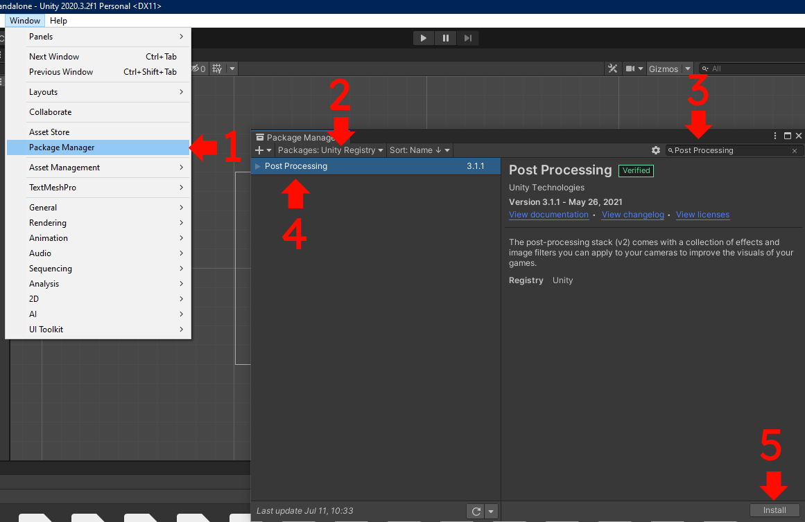

<p align="center">
  
</p>

# Setup

This document describes the setup process for [Tale](https://github.com/deprimus/Tale), a storytelling and prop manipulation utility for Unity.

After following the setup process, you may start using Tale. Reading the [documentation]() is highly recommended for beginner users.

This setup assumes you have at least minimal knowledge about Unity, the entity component system (ECS), and the C# programming language.
You need to know what components are and how to add them to objects. The optional setup may require additional knowledge.

The setup is split into 2 parts: required and optional. The former describes how to set up the Tale core, while the latter describes
how to set up optional modules.

## Glossary

Here are a collection of words that you will encounter in the context of Tale.

- Prop: an object or component which can be manipulated by Tale. Usually refers to a GameObject, an Animator, an AudioSource, etc
- Master: the Tale Master object which has a `TaleMaster` component
- Queue: actions are placed on a queue. After the first action in the queue finishes, it is removed the next one starts. This goes on forever
- Parallel: some actions can be added to the the parallel list. All of the actions in the parallel list execute at the same time, and also
don't interfere with the queue. Once an action is finished, it is removed from the list
- Parallel Pointer: points to one or more actions that are in the parallel list, usually used to manually remove actions
- Multiplex: a multiplex action. Executes multiple actions at a time until they all finish. After that, the multiplex action is marked as finished
- Group: a GameObject which has the purpose of grouping props of a certain category (dialog, audio, etc)
- Actor: the person who speaks in a dialog
- Override Dialog: normal dialog. When an actor speaks, the dialog text will be erased and replaced by the new reply
- Additive Dialog: when an actor speaks using additive mode, the next reply will be added to the current dialog text
- CTC: click-to-continue, in the context of dialog. This refers to the object that appears when the user is prompted to click or press a button in order to advance
- ACTC: alternative CTC, which appears when there is additive dialog
- Cinematic: the cinematic canvas, which can contain an image, a video, or subtitles. Usually used to show cutscenes or introduction text
- Subtitles: text on the cinematic canvas, usually used as a way of storytelling or as actual subtitles for a video

## Prerequisites

You will need a new/existing Unity 2D project. For the purpose of this guide, a new project will be used.

Please note that Tale was developed for Unity 2020.3.2f1. It is not guaranteed to work with any other versions.

You will also need the Tale source code.

### Downloading Tale

If you want to use a Tale release, download the release archive (none as of now).

If you want to use the latest Tale version, clone the repository (or download as zip).

## Required Setup

This section contains all necessary steps required to get Tale up and running. This section is mandatory and cannot be skipped.

Open your Unity project and make sure you have the Tale source code handy. The setup steps are as follows:

### 1. Copy the Tale scripts

In your project, if the `Assets/Scripts` directory doesn't exist, create it. Inside it, create another directory named `Tale`.

Go to the Tale source code, navigate inside the `src` folder, and copy everything to the `Assets/Scripts/Tale` folder.
This path is not imposed, but recommended.

The `Tale` directory should look something like this:

<p align="center">
  
</p>

After copying the files, you no longer need to have the Tale source code handy.

At this point, you may see an error: `The type or namespace name 'PostProcessing' does not exist...`. It will disappear
once you follow the next step.

### 2. Install the required dependencies

Tale relies on TextMesh Pro and PostProcessing. The former is usually already installed by Unity, and is only required for other
optional modules. The latter has to be manually installed and is required in order for Tale to work.

Go to `Window -> Package Manager`. At the top-right of the package manager window, to the left of the `+` icon, click on the `Packages`
dropdown box and select `Unity Registry`.

Search for `Post Processing` at the top left of the window. Click on the package that appears (it should be named `Post Processing`),
then click on the `Install` button at the bottom left of the window.

<p align="center">
  
</p>

> Note: in the future, the PostProcessing package will only be required if camera effects are enabled. For now, you have to install it even if you don't
> intend to use such effects.

### 3. Create the Tale Master object

The master object is the heart of Tale, and is responsible for single-handedly orchestrating all of the actions. If this object is disabled,
Tale will cease to function.

In your default scene, create a new empty game object. Call it `Tale Master` and add the `TaleMaster.cs` script to it. Make sure the object
is at the top of the hierarchy.

<p align="center">
  
</p>

<p align="center">
  
</p>

The master object should look something like this:

<p align="center">
  
</p>

Everything listed there is used by the optional modules. Details about them can be found in the [optional setup]() section.

> Note: the Tale master object can only be instantiated once. If any other objects with the TaleMaster component appear in the future,
> they will be automatically deleted. If you delete the master object at runtime, you will not be able to instantiate a new one.
> This prevents duplicate masters from being active at the same time.

### 4. Create the master prefab

In order for Tale to work properly, the master object must be present in every scene. Duplicate master objects will be automatically
deleted at runtime. This way, Tale can function regardless of the scene from which you start the game.

You may skip this step if you wish to add optional modules. However, don't forget to come back here after you finish setting everything up.

In your project, navigate to the `Assets/Prefabs` directory (create it if needed). Drag the master object into the prefab folder.

It should look like this:

<p align="center">
  
</p>

After doing so, drag the prefab into any existing/future scenes, and make sure that the master object always sits at the top of the hierarchy.

If you want to modify the master object (e.g. to add optional modules), you should modify the prefab. This is the reason why it is recommended to
finish setting up Tale before creating the prefab.

### 5. Test

If you want to see if Tale works properly, create a game object and attach the following script to it:

```cs
using UnityEngine;

public class TaleTest : MonoBehaviour
{
    void Start()
    {
        Tale.Exec(() => Debug.Log("Tale works."));
    }
}

```

Make sure to name the script `TaleTest.cs`. Press `Play` and check if `Tale works.` is logged. If so, Tale was correctly set up. You may now add optional
modules by following the optional setup.

## Optional Setup

This section contains all necessary steps required to set up any optional modules. The modules can be set up in no particular order. However, for the sake
of this guide, the modules will be set up in the order that they appear in.

Optional modules may require extra objects (props). These should be children of the master object.

Some modules make use of the Tale config file, which is located in `Assets/Scripts/Tale` (the Tale source code). The file is named `Config.cs`, and allows
you to adjust various parameters. Each module will describe each parameter that it makes use of.

### Dialog

The dialog module can be used to show dialog on the screen. Animations can be added in order to gracefully transition to and from dialog. There are also
CTC objects, which are there to prompt the player to click or press a button in order to advance the dialog.

The dialog module uses the following props:

- a canvas
- an object with an Animator component (this object can be the canvas itself)
- two objects with TextMeshProUGUI components (one for the actor, one for the content)
- two objects with Animator components (for CTC and ACTC; both are optional)

Here is the general flow of a dialog action:

- the dialog action starts running
- if the dialog canvas is not activated, it is activated and the DialogIn animation will be played (if animations are present)
- the dialog actor will be set, and the content will be typed character-by-character (if the dialog is in additive mode, the content
will be added to the existing text. Otherwise, it will replace the existing text)
- after the content was fully typed, the CTC object will be activated and placed after the text (or ACTC if the dialog is in additive mode)
- after the user advances the dialog, the CTC object is deactivated and:
  - if the next action is a dialog action, the canvas is left active
  - otherwise, the DialogOut animation is played (if present) and the canvas is deactivated
- the dialog action ends

First, create the dialog canvas and name it `Dialog Canvas`. If an EventSystem object is created, make sure that it is also a child of the master object.

<p align="center">
  
</p>

Make sure to change the scale mode to `Scale With Screen Size`. You can customize the reference resolution and match mode. In this example, 1920x1080 will be used.

<p align="center">
  
</p>

Next, create the actor and content objects (`UI`->`Text - TextMeshPro`). In this example, they will be placed inside a Panel (`UI`->`Panel`).
If the following window pops up, click on `Import TMP Essentials`.

<p align="center">
  
</p>

<p align="center">
  
</p>

You may place these objects anywhere on the canvas and customize them however you like (width, height, font, style, etc). In this example,
the actor and content objects will be placed at the bottom of the screen inside a panel like this:

<p align="center">
  
</p>

Both objects should have their alignments set to top-left. You may change this, however please note that you won't be able to make use of CTC objects because
the position can only be determined accurately with top-left alignment. Other alignments will make the CTC objects appear in unexpected places.

If you don't want to use CTC objects, you can change the alignment with no compromises.

<p align="center">
  
</p>

You may also want to customize the overflow. In this example, the actor object uses `Ellipsis` while the content object uses `Scroll Rect`.

<p align="center">
  
</p>

<p align="center">
  
</p>

#### Animations

Every time a dialog action starts or ends, an animation will played in order to make a transition between normal gameplay and dialog.
You may skip adding animations, as they are entirely optional (in which case the dialog canvas will be the activated and deactivated with no transition).

If you want to add animations, you will need an Animator component (it doesn't have to be attached to the dialog canvas; it can be attached to,
for example, the panel that holds the actor and content objects). The animations can behave in any way: they can change the canvas opacity,
they can just move an object (e.g. a panel), or they can do something entirely different.

There are only 2 constraints:
- the controller must have 2 animations: one for DialogIn and one for DialogOut
- the controller must have 3 states: one for DialogIn, one for DialogOut, and one for Idle (Entry and Any State do not count).
- the states need to be connected in a certain way (see below)

In this example, the canvas opacity will be animated. In order to do this, a `Canvas Group` component will be added to the canvas.

<p align="center">
  
</p>

Two animations will be added:

- DialogIn: changes the canvas opacity from 0 to 1 in 0.5s
- DialogOut: changes the canvas opacity from 1 to 0 in 0.5s

It is recommended to save the animations in `Assets/Animations/Tale`.

<p align="center">
  
</p>

Make sure the dialog canvas has an `Animator` component and that the controller is set correctly. Make sure that the animator component
is enabled (it may be disabled by default).

<p align="center">
  
</p>

The animations must not have loop time. This is checked by default, so make sure to uncheck it.

<p align="center">
  
</p>

The animation controller now needs to be set up in the `Animator` window. The states may look like this:

<p align="center">
  
</p>

Create a new state called `Idle`, and set it as the layer default state.

<p align="center">
  
</p>

For both animations, make sure to uncheck `Write Defaults`. It may interfere with Tale if left enabled,
because Tale changes some properties of the canvas object behind the scenes and these changes may be overwritten by the animation.

<p align="center">
  
</p>

Make sure the states corresponding to the animations are named exactly `DialogIn` and `DialogOut`. This is needed because Tale makes use of those names.

If you don't like these names, you may change them in the config file. Simply navigate to `Assets/Scripts/Tale` (the tale source code), and open the `Config.cs`
file. Next, change the following:

- DIALOG_CANVAS_ANIMATOR_STATE_IN: this is the name of the state corresponding to the DialogIn animation
- DIALOG_CANVAS_ANIMATOR_STATE_OUT: this is the name of the state corresponding to the DialogOut animation

The state names must match these values. In this guide, the default names will be used.

After you make the changes, you can use the names that you provided. It's important to not use the same name for both states, as this leads to undefined behavior.

Create 3 triggers: one named `TransitionIn`, one named `TransitionOut` and one named `Neutral`. Like the animation states, the transitions must have these exact names,
which can be changed from the config file:

- DIALOG_CANVAS_ANIMATOR_TRIGGER_IN: this is for the `Idle`->`DialogIn` transition
- DIALOG_CANVAS_ANIMATOR_TRIGGER_OUT: this is for the `Idle`->`DialogOut` transition.
- DIALOG_CANVAS_ANIMATOR_TRIGGER_NEUTRAL: this is for the `DialogIn`->`Idle` and `DialogOut`->`Idle` transitions

<p align="center">
  
</p>

Create the `Idle`->`DialogIn` transition, uncheck `Has Exit Time` and set the condition to `TransitionIn` (the name of your `In` trigger).

<p align="center">
  
</p>

Create the `Idle`->`DialogOut` transition in the same way (uncheck `HasExitTime`, set the condition to `TransitionOut`). You should end up with something like this:

<p align="center">
  
</p>

Next, create the `DialogIn`->`Idle` transition. Uncheck `Has Exit Time`, set the condition to `Neutral` (the neutral trigger), open the settings menu and set
the transition duration to 0 (because the transition should happen immediately after the animation finishes).

<p align="center">
  
</p>

Create the `DialogOut`->`Idle` transition in the same way (no exit time, neutral trigger, transition time set to 0).

The final controller should look like this.

<p align="center">
  
</p>